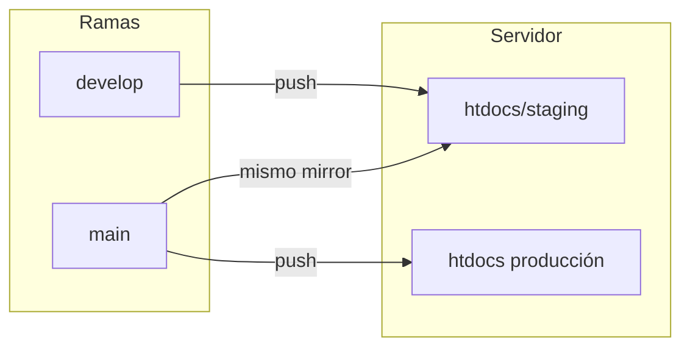

<div align="center">

# Hacia el Ocaso · Sitio web

**Repo del sitio oficial y herramientas en vivo** — Bootstrap, experiencias tipo terminal, presentación de disco y deploy automático.

[](https://github.com/jmalbarra/heo-website-bootstrap)
[](https://linktr.ee/haciaelocaso)
[](https://www.instagram.com/heo.oficial/)

*Las URLs “en producción” asumen el sitio servido en la raíz del hosting (`/`). Staging suele vivir bajo `/staging/` según el deploy.*

</div>

---

## Tabla de contenidos

- [Qué hay en este repo](#qué-hay-en-este-repo)
- [Páginas del sitio (estáticas)](#páginas-del-sitio-estáticas)
- [Experiencias especiales](#experiencias-especiales)
- [Estructura de carpetas](#estructura-de-carpetas)
- [Deploy y ramas](#deploy-y-ramas)
- [Enlaces rápidos](#enlaces-rápidos)

---

## Qué hay en este repo

| Bloque | Descripción |
|--------|-------------|
| **Sitio principal** | Páginas HTML con plantilla Colorlib: música, fechas, prensa, fotos, videos, contacto, etc. |
| **`n0m10s/`** | Experiencia “Matrix” + terminal: login, chat con Nomios (API externa). |
| **`presentacion-album-mdufc/`** | Show en vivo: setlist con desbloqueo, letras, operador, y **foto para redes** (share). |
| **Assets globales** | `css/`, `js/`, `images/`, `fonts/` compartidos por el sitio clásico. |
| **CI/CD** | GitHub Actions: mirror SFTP a staging (`develop`) y producción (`main`). |

La **`index.html`** de la raíz [redirige a Linktree](index.html) (`linktr.ee/haciaelocaso`). El sitio “completo” con navegación está en [`index_hidden.html`](index_hidden.html) (y el resto de `.html` en raíz).

---

## Páginas del sitio (estáticas)

Rutas relativas al dominio. En GitHub podés abrir el archivo con el segundo enlace.

| Página | Rol |
|--------|-----|
| [`/`](index.html) | Redirección a [Linktree](https://linktr.ee/haciaelocaso). |
| [`/index_hidden.html`](index_hidden.html) | Home con layout completo (plantilla principal). |
| [`/musica.html`](musica.html) | Música / discografía. |
| [`/shows.html`](shows.html) | Shows y fechas. |
| [`/nosotros.html`](nosotros.html) | Banda. |
| [`/fotos.html`](fotos.html) | Fotos. |
| [`/videos.html`](videos.html) | Videos embebidos (YouTube). |
| [`/gallery.html`](gallery.html) | Galería / embeds Spotify. |
| [`/prensa.html`](prensa.html) | Prensa. |
| [`/contact.html`](contact.html) | Contacto. |
| [`/youtube.html`](youtube.html) | Página / utilidad YouTube. |
| [`/spotify.html`](spotify.html) | Redirección al álbum en Spotify. |
| [`/single.html`](single.html), [`/pricing.html`](pricing.html) | Páginas de plantilla (Colorlib). |

---

## Experiencias especiales

### n0m10s — Terminal y Nomios

| Qué | Dónde |
|-----|--------|
| Entrada estilo Matrix, login (nombre + email + términos), terminal y chat con **Nomios**. | **[`n0m10s/index.html`](n0m10s/index.html)** → en vivo: `/n0m10s/` o `/n0m10s/index.html` |

- Estética oscura, acento cian `#22eec9`, fuentes Geist / Space Grotesk.
- API de chat configurada en el propio `index` (variable `NOMIOS_CHAT`).
- **La lógica de IA de Nomios** (prompt del sistema, configuración del modelo, etc.) vive en el repo separado **[`nomios-ai`](https://github.com/jmalbarra/nomios-ai)**. Si necesitás cambiar el comportamiento del chat, ese es el lugar.

---

### Presentación en vivo — *Mitos de un futuro cercano*

Mini app para el show: temas que se desbloquean según el avance, letras y texto “de qué habla”. PHP + JSON en servidor; modo dev con `?dev=1`.

| Vista | Archivo | URL típica |
|-------|---------|------------|
| **Público** (QR del público) | [`presentacion-album-mdufc/index.html`](presentacion-album-mdufc/index.html) | `/presentacion-album-mdufc/` |
| **Operador** (solo staff; avanza el índice) | [`presentacion-album-mdufc/operator.html`](presentacion-album-mdufc/operator.html) | `/presentacion-album-mdufc/operator.html` |
| **Foto para redes** (glitch + marca, descarga PNG) | [`presentacion-album-mdufc/share.html`](presentacion-album-mdufc/share.html) | `/presentacion-album-mdufc/share.html` |

Documentación detallada: **[`presentacion-album-mdufc/README.md`](presentacion-album-mdufc/README.md)** (setlist, secreto del operador, permisos PHP, checklist pre-show).

---

## Estructura de carpetas

```
heo-website-bootstrap/
├── .github/workflows/          # Deploy SFTP (develop → staging, main → prod)
├── css/, js/, images/, fonts/   # Sitio principal
├── n0m10s/                     # Experiencia Nomios
├── presentacion-album-mdufc/
│   ├── index.html, operator.html, share.html
│   ├── api/, data/, includes/  # PHP, estado, setlist
│   └── README.md
├── *.html                      # Páginas raíz del sitio
└── README.md                   # Este archivo
```

---

## Deploy y ramas



- **Push a `develop`** → despliegue a **staging** (`htdocs/staging`).
- **Push a `main`** → despliegue a **producción** y también se refleja en staging según el workflow.

### Infraestructura

| Qué | Dónde / Proveedor |
|-----|-------------------|
| **Dominio** | Comprado en **GoDaddy** |
| **Hosting** | **InfinityFree** (htdocs raíz = producción) |

Los workflows usan **checkout**, **lftp mirror** con comparación por tamaño (`--ignore-time`) y exclusiones (`.git`, `.github`), para no resubir todo el repo en cada corrida.

Archivos: [`.github/workflows/deploy-develop-to-stg.yaml`](.github/workflows/deploy-develop-to-stg.yaml) · [`.github/workflows/deploy-main-to-prod.yaml`](.github/workflows/deploy-main-to-prod.yaml)

---

## Enlaces rápidos

| Dónde | Link |
|-------|------|
| Este repo | [github.com/jmalbarra/heo-website-bootstrap](https://github.com/jmalbarra/heo-website-bootstrap) |
| Linktree oficial | [linktr.ee/haciaelocaso](https://linktr.ee/haciaelocaso) |
| Instagram | [@heo.oficial](https://www.instagram.com/heo.oficial/) |

---

<div align="center">

*Sitio basado en plantilla [Colorlib](https://colorlib.com); experiencias `n0m10s` y `presentacion-album-mdufc` son desarrollos propios sobre esa base.*

</div>
