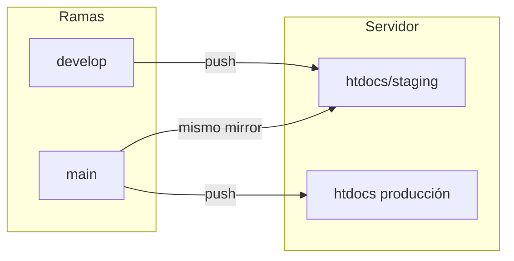

<div align="center">

# Hacia el Ocaso · Sitio web

**Repo del sitio oficial y herramientas en vivo** — Bootstrap, experiencias tipo terminal, presentación de disco y deploy automático.

[](https://github.com/jmalbarra/heo-website-bootstrap)
[](https://linktr.ee/haciaelocaso)
[](https://www.instagram.com/heo.oficial/)

*Las URLs “en producción” asumen el sitio servido en la raíz del hosting (`/`). Staging suele vivir bajo `/staging/` según el deploy.*

</div>

---

## Tabla de contenidos

- [Qué hay en este repo](#qué-hay-en-este-repo)
- [Páginas del sitio (estáticas)](#páginas-del-sitio-estáticas)
- [Experiencias especiales](#experiencias-especiales)
- [Estructura de carpetas](#estructura-de-carpetas)
- [Deploy y ramas](#deploy-y-ramas)
- [Enlaces rápidos](#enlaces-rápidos)

---

## Qué hay en este repo

| Bloque | Descripción |
|--------|-------------|
| **Sitio principal** | `index.html` home con todas las secciones: música, shows, experiencias, videos, fotos, nosotros, contacto. |
| **`tienda/`** | Catálogo de merch con carrito y checkout por WhatsApp a Nelo. 22 productos con imagen real. |
| **`n0m10s/`** | Experiencia “Matrix” + terminal: login, chat con Nomios (API externa). |
| **`union/`** | El bonus track del disco se llama `haciaelocaso.com/union`: acá aterriza esa gente. Alta a la comunidad + credencial de miembro. |
| **`presentacion-album-mdufc/`** | Show en vivo: setlist con desbloqueo, letras, operador, y **foto para redes** (share). |
| **`manager/`** | Redirect oculto (noindex) al panel interno de la banda en Vercel. |
| **Assets globales** | `css/`, `js/`, `images/` (incluyendo `merch/`), `fonts/`. |
| **CI/CD** | GitHub Actions: mirror SFTP a staging (`develop`) y producción (`main`). |

La **`index.html`** de la raíz es el home principal del sitio con navegación completa. La versión anterior (redirect a Linktree) quedó archivada en [`index_20260430.html`](index_20260430.html).

---

## Páginas del sitio (estáticas)

Rutas relativas al dominio. En GitHub podés abrir el archivo con el segundo enlace.

| Página | Rol |
|--------|-----|
| [`/`](index.html) | Home principal: música, shows, experiencias, videos, fotos, nosotros, contacto. |
| [`/tienda/`](tienda/index.html) | Tienda de merch oficial con carrito y checkout por WhatsApp. |
| [`/union/`](union/index.html) | Agradecimiento y alta a la comunidad para quien llega por el último tema del disco. |
| `/union/<CÓDIGO>` ([archivo](union/credencial.html)) | Credencial del miembro: número, imagen para redes y pantalla para mostrar en el show. |
| [`/index_20260430.html`](index_20260430.html) | Redirect viejo a Linktree (archivado). |
| [`/spotify.html`](spotify.html) | Redirección al álbum en Spotify. |
| [`/single.html`](single.html), [`/pricing.html`](pricing.html) | Páginas de plantilla (Colorlib, legacy). |

---

## Experiencias especiales

### manager — Panel interno ⚠️ OCULTO

| Qué | Dónde |
|-----|--------|
| Redirección al panel de gestión interno de la banda. | **[`manager/index.html`](manager/index.html)** → en vivo: `/manager/` |

- **Destino:** [`heo-band-manager.vercel.app`](https://heo-band-manager.vercel.app)
- **Acceso:** Solo por URL directa — no está linkeado en ninguna parte del sitio.
- **Indexación:** `noindex, nofollow` — no aparece en buscadores.
- La página solo contiene un redirect inmediato (meta refresh + JS); no tiene contenido propio.

> ⚠️ No agregar este link al nav ni a ninguna página pública.

---

### n0m10s — Terminal y Nomios

| Qué | Dónde |
|-----|--------|
| Entrada estilo Matrix, login (nombre + email + términos), terminal y chat con **Nomios**. | **[`n0m10s/index.html`](n0m10s/index.html)** → en vivo: `/n0m10s/` o `/n0m10s/index.html` |

- Estética oscura, acento cian `#22eec9`, fuentes Geist / Space Grotesk.
- API de chat configurada en el propio `index` (variable `NOMIOS_CHAT`).
- **La lógica de IA de Nomios** (prompt del sistema, configuración del modelo, etc.) vive en el repo separado **[`nomios-ai`](https://github.com/jmalbarra/nomios-ai)**. Si necesitás cambiar el comportamiento del chat, ese es el lugar.

---

### Tienda — Merch oficial

| Qué | Dónde |
|-----|--------|
| Catálogo de merch con carrito y checkout automático por WhatsApp. | **[`tienda/index.html`](tienda/index.html)** → en vivo: `/tienda/` |

- **22 productos** con imagen real en `images/merch/` — nombre = filename sin extensión.
- Categorías: **Clásico** (teal) y **Cae el Velo** (violeta).
- Carrito lateral con thumbnails; checkout genera mensaje preformateado a Nelo en WhatsApp (+54 9 11 3481-5776).
- Click en imagen abre lightbox de zoom.
- PDF con QR para mesa de merch: [`tienda/tienda-qr.pdf`](tienda/tienda-qr.pdf).

---

### Presentación en vivo — *Mitos De Un Futuro Cercano*

Mini app para el show: temas que se desbloquean según el avance, letras y texto “de qué habla”. PHP + JSON en servidor; modo dev con `?dev=1`.

| Vista | Archivo | URL típica |
|-------|---------|------------|
| **Público** (QR del público) | [`presentacion-album-mdufc/index.html`](presentacion-album-mdufc/index.html) | `/presentacion-album-mdufc/` |
| **Operador** (solo staff; avanza el índice) | [`presentacion-album-mdufc/operator.html`](presentacion-album-mdufc/operator.html) | `/presentacion-album-mdufc/operator.html` |
| **Foto para redes** (glitch + marca, descarga PNG) | [`presentacion-album-mdufc/share.html`](presentacion-album-mdufc/share.html) | `/presentacion-album-mdufc/share.html` |

Documentación detallada: **[`presentacion-album-mdufc/README.md`](presentacion-album-mdufc/README.md)** (setlist, secreto del operador, permisos PHP, checklist pre-show).

---

## Estructura de carpetas

```
heo-website-bootstrap/
├── .github/workflows/          # Deploy SFTP (develop → staging, main → prod)
├── css/, js/, fonts/           # Sitio principal
├── images/
│   ├── merch/                  # Fotos de productos (22 PNG)
│   └── ...                     # Resto de assets del sitio
├── tienda/                     # Tienda de merch
│   ├── index.html
│   └── tienda-qr.pdf           # Flyer con QR para mesa de merch
├── manager/                    # Redirect oculto → heo-band-manager.vercel.app
├── n0m10s/                     # Experiencia Nomios
├── union/                      # Alta a la comunidad (bonus track del disco)
│   ├── index.html              # Gracias + formulario
│   ├── credencial.html         # Credencial por código
│   └── .htaccess               # /union/<CÓDIGO> → credencial.html
├── presentacion-album-mdufc/
│   ├── index.html, operator.html, share.html
│   ├── api/, data/, includes/  # PHP, estado, setlist
│   └── README.md
├── index.html                  # Home principal
├── index_20260430.html         # Redirect viejo a Linktree (archivado)
└── README.md                   # Este archivo
```

---

## Unión: la comunidad

El último tema de *Mitos De Un Futuro Cercano* no tiene título: se llama
`haciaelocaso.com/union`. Quien escucha el disco hasta el final y escribe esa
dirección cae en [`union/`](union/index.html), donde le agradecemos y le
ofrecemos sumarse.

**Cómo funciona:**

1. El formulario manda nombre y mail a `POST /union/join` de la API de Nomios
   (repo [`nomios-ai`](https://github.com/jmalbarra/nomios-ai)), con
   `source: "union"`.
2. La API guarda el alta, le asigna un número de miembro correlativo y un código
   público, y le manda el mail de bienvenida por Resend.
3. El código abre su credencial en `haciaelocaso.com/union/<CÓDIGO>`: se baja
   como PNG 1080×1350 para redes o se muestra desde el teléfono en el show.

**Una sola lista:** el login de `n0m10s/` también da de alta por el mismo
endpoint, con `source: "n0m10s"`, así las métricas dicen por dónde llegó cada
persona. `n0m10s/subscribe.php` quedó como red de contención por si la API no
responde.

**La URL linda** (`/union/<CÓDIGO>` en vez de `/union/credencial.html?c=…`) la
hace el `.htaccess` de la carpeta. Si el hosting no tuviera mod_rewrite, el link
con `?c=` sigue funcionando igual.

---

## Deploy y ramas


```mermaid
flowchart LR
  subgraph branches [Ramas]
    D[develop]
    M[main]
  end
  subgraph servers [Servidor]
    STG[htdocs/staging]
    PRD[htdocs producción]
  end
  D -->|push| STG
  M -->|push| PRD
  M -->|mismo mirror| STG
```

- **Push a `develop`** → despliegue a **staging** (`htdocs/staging`).
- **Push a `main`** → despliegue a **producción** y también se refleja en staging según el workflow.

### Infraestructura

| Qué | Dónde / Proveedor |
|-----|-------------------|
| **Dominio** | Comprado en **GoDaddy** |
| **Hosting** | **InfinityFree** (htdocs raíz = producción) |

Los workflows usan **checkout**, **lftp mirror** con comparación por tamaño (`--ignore-time`) y exclusiones (`.git`, `.github`), para no resubir todo el repo en cada corrida.

Archivos: [`.github/workflows/deploy-develop-to-stg.yaml`](.github/workflows/deploy-develop-to-stg.yaml) · [`.github/workflows/deploy-main-to-prod.yaml`](.github/workflows/deploy-main-to-prod.yaml)

---

## Enlaces rápidos

| Dónde | Link |
|-------|------|
| Este repo | [github.com/jmalbarra/heo-website-bootstrap](https://github.com/jmalbarra/heo-website-bootstrap) |
| Linktree oficial | [linktr.ee/haciaelocaso](https://linktr.ee/haciaelocaso) |
| Instagram | [@heo.oficial](https://www.instagram.com/heo.oficial/) |

---

<div align="center">

*Sitio basado en plantilla [Colorlib](https://colorlib.com); experiencias `n0m10s` y `presentacion-album-mdufc` son desarrollos propios sobre esa base.*

</div>
